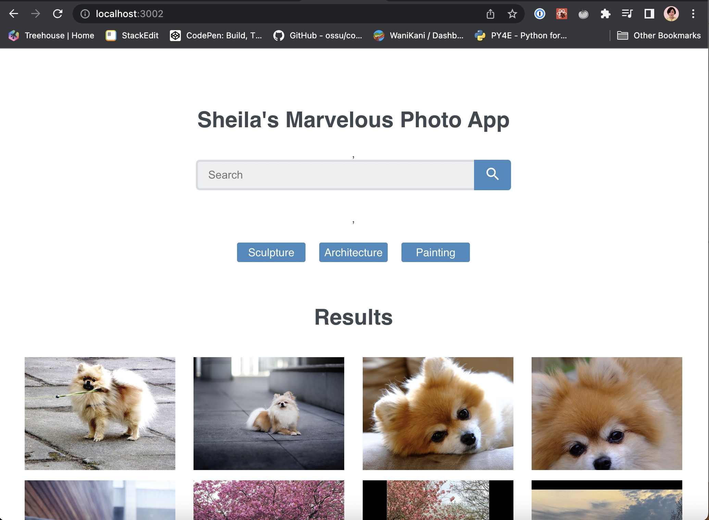
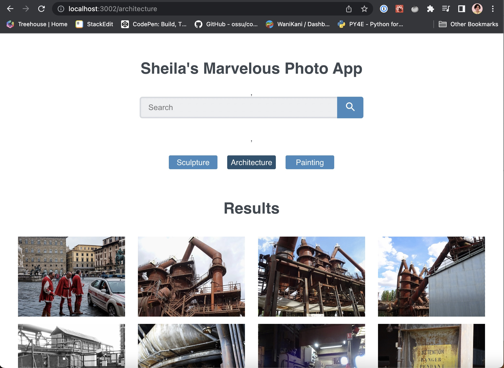
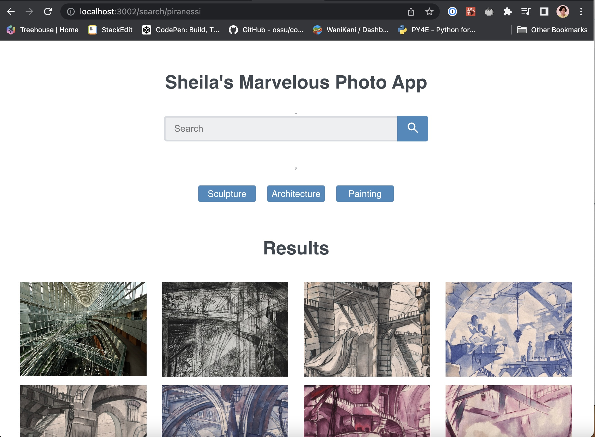

# Treehouse Techdegree FSJS
## Project 7- React Gallery

A single-page application(SPA) using React and React Router 5 that displays a collection of 24 photos using the Flicker API.


## Technologies
* HTML
* CSS
* JavaScript
* APIs
* React
* React Router 5

## Installation
- Downlod the project files
- run `npm install` to install all project dependencies
- Request your  non commercial [Flicker API key](https://www.flickr.com/services/apps/create/apply/) and create a `config.js` file on the same level as App.js following this template:

```javascript
const apiKey = 'here put your key';

export default apiKey;
```
- run `npm start` in your terminal

## Project Description
The page has a preload collection to provide a better user experience


At the same time when the application is mounted it loads the 3 button's galleries and push them into the `<PhotoList>` component when is clicked


Finally the app creates programatically a search route when the search is made
